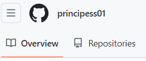

# Markdown

Failo pletinys: .md 

Issamesne info: https://docs.github.com/articles/basic-writing-and-formatting-syntax

Laba diena!

## Sarasas

daiktai:
- pomidoras
- lavasas
- keksas
  - laukas
  - vakaras
  - laivai
- saukstas

### Bold ir Italic

Labas rytas, Lietuva

**Labas** rytas, Lietuva
Labas _rytas_, Lietuva

## Nuorodos 
Github: [mano profilis](https://github.com/principess01).

## Nuotraukos

